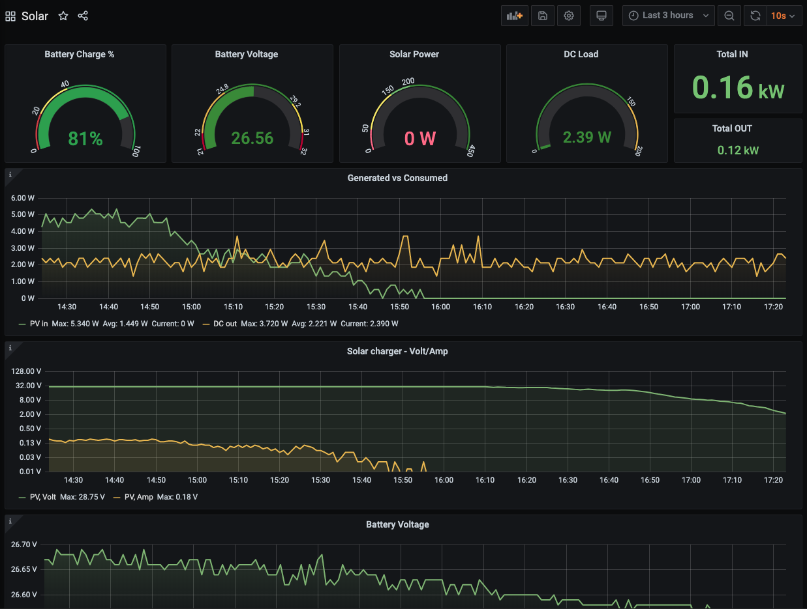

Monitoring EPsolar UPower and Tracer devices from Raspberry Pi with Python via RS-485
===================================================

**EPSolar Tracer** AN/BN devices have been around for a while so this is just another attempt to establish a good monitoring package.

**EPSolar UPower** hybrid inverters are great at what they do, however it is difficult to get them monitored if you have a Linux machine as they are still new and the protocol is not publicly available. Out of my communication with EPSolar I managed to obtain the list of registers and develop a UPower Python module.

Look into [epsolar-docs/](epsolar-docs/) to find the details.

## Requirements
- Python 2.7 (standard Python coming with Raspberry Pi of the latest versions of Raspbian)
- Influx DB and Python modules
- Grafana
- [Minimal Modbus](https://minimalmodbus.readthedocs.io/en/stable/) module for Python

Make sure you install the Linux driver for Exar USB UART first
--------------------------------------------------------------
The [xr_usb_serial_common](xr_usb_serial_common-1a/) directory contains the makefile and instructions that will compile properly on Rasbian OS on a raspberry pi 3. Before compiling be sure to install the linux headers with
`sudo apt-get install raspberrypi-kernel-headers`

After installing the headers be sure to `sudo bundle` then `sudo make`.
The resulting `xr_usb_serial_common.ko` file will need to be moved to `/lib/modules/YOUR_LINUX_VERSION/extra/`.
After building and moving the module, remove the cdc-acm driver that automatically installs for the usb-485 adapter.

`rmmod cdc-acm`
`modprobe -r usbserial`
`modprobe usbserial`

You will also need to add the cdc-acm to the system blacklist:

`echo blacklist cdc-acm > /etc/modprobe.d/blacklist-cdc-acm.conf`
Note: If echo doesnt work you will need to add `blacklist cdc-acm` manually to the blacklist with vim `vi /etc/modprobe.d/blacklist-cdc-acm.conf`

Finally add `xr_usb_serial_common` to '/etc/modules' to autoload the module on startup.

After all of this is done make sure that the new driver loads correctly by reloading the linux dependency list `depmod -ae`
Then load the module with `modprobe xr_usb_serial_common`

If all goes well you should see `ttyXRUSB` when listing `ls /dev/tty*`

Reboot and enjoy!

Tracer AN/BN Protocol
---------------------
[Protocol for Epsolar Tracer](http://www.solar-elektro.cz/data/dokumenty/1733_modbus_protocol.pdf) on the Czech solar company website

Python modules
--------------
Install minimalmodbus first:
`pip install minimalmodbus`

`SolarTracer.py` is the module to communicate with Tracer AN/BN controller
`UPower.py` is for communication with UPower inverters

Logging scripts
--------------
The file `logtracer.py` will query the Tracer AN/BN controller for relevant data and store into Influx DB.
The file `logupower.py` will query the UPower inverter for relevant data and store into Influx DB.

By default these scripts write the output into the console (as well as the database). Use > /dev/null to make them "silent".

## Setting up a cron job to run this script regularly:

1. First make `logupower.py` an executable:
`sudo chmod +x log*.py`

3. Now add the cron job:

`crontab -e`

3. add the line to log the values every minute:

`* * * * *  cd /home/pi/solartracer && python logtracer.py > /dev/null`

4. you can add another line if you want it every half a minute:

`* * * * *  cd /home/pi/solartracer && sleep 30 && python logtracer.py > /dev/null`

Grafana Dashboard
--------------------

The [grafana/](grafana/) folder contains everything needed to setup a dashboard to monitor realtime and historical solar charging data.

## Grafana/InfluxDB installation

### become a superuser
`sudo -i`
### update and install the packages
`apt update && apt upgrade`

`apt install influxdb python-influxdb influxdb-client grafana`

Run http://raspberrypi.local:3000 (or whatever your name for the Raspberry Pi is) to configure the Grafana console
You can import SolarDashboard from [grafana/] folder.

Additional scripts
------------------
`setTracerVoltages.py` will rewrite Tracer AN/BN voltages to support LiFePO4 batteries.

Current settings are for 24V LiFePO4, however the script can be easily changed to set values for 12V and also other types of batteries. There is a pre-filled array for LiFePO4 and a Lead-Acide flooded battery in the script. See the comments on how to choose it.

`ivctl.py` may be used to switch the inverter off/on for the night
